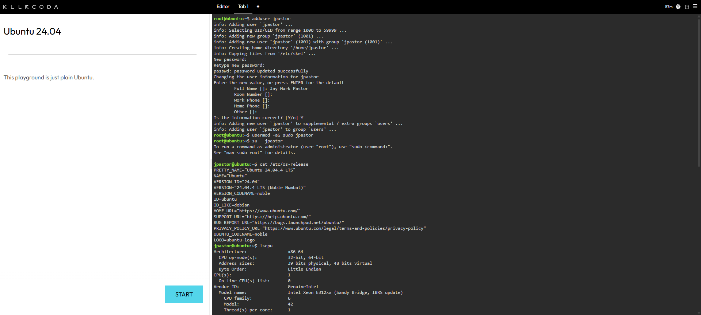
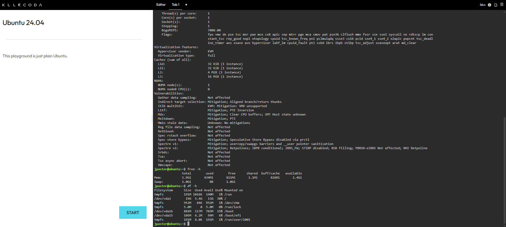

## Checkpoint 7 — Linux Investigation

### System Specifications

- **Operating System:** Ubuntu 24.04.4 LTS (Noble Numbat)
- **CPU Information:** x86_64 architecture, Intel Xeon E312xx (Sandy Bridge), 1 vCPU (1 socket, 1 core per socket, 1 thread per core)
- **Memory:** 1.9 GiB total, 434 MiB used, 811 MiB free (1.4 GiB available)
- **Disk Space:** 19 GB total on `/dev/vda1`, 5.4 GB used, 13 GB available (30% used)

### Screenshots

### Cloud Migration Analysis

**If this Linux server were migrated to the cloud, which AWS, Azure, and GCP services could host it?**

Given its modest specs (1 vCPU, ~2 GiB RAM, ~19 GB disk), this Linux server is a lightweight workload that could run comfortably on a small instance across any of the three providers. On AWS, an Amazon EC2 t3.micro or t3.small instance running Ubuntu would match these specs closely. On Azure, an equivalent Azure Virtual Machine using the B-series (e.g., B1s or B2s), which is designed for low-to-moderate workloads, would be a good fit. On GCP, a Compute Engine e2-micro or e2-small instance would offer similar performance at a comparable cost. If the workload were containerized instead, it could also run on managed Kubernetes services such as Amazon EKS, Azure Kubernetes Service (AKS), or Google Kubernetes Engine (GKE).
